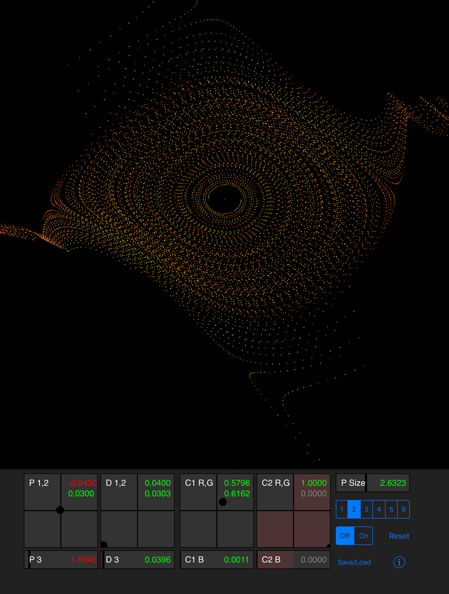

# Dynamical_IOS
Dynamical Systems for IOS iPads, using Swift and Metal.

A cloud of points are set to a starting position,
then 50 times they are each iterated through an equation to determine a new position.
At certain parameter settings strange attractions result.
At other settings the points diverge to chaos.

